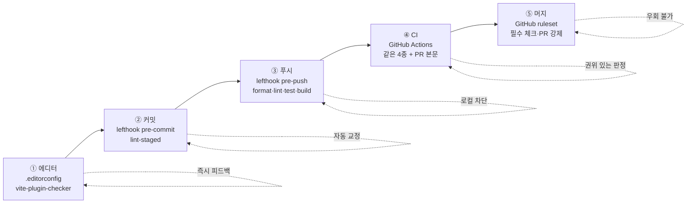
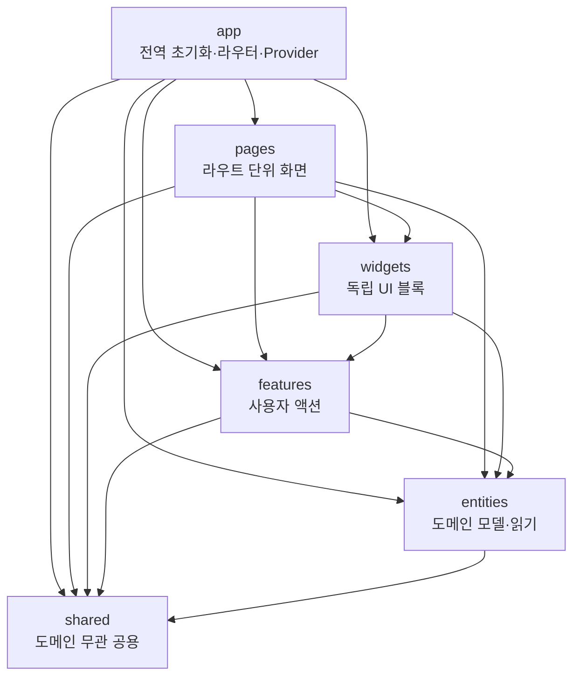

# 규칙 지도

이 프로젝트에 적용된 모든 규칙과 그것을 강제하는 도구의 전체 지도.
"무엇을 왜 막는가" 를 담는다. 룰의 구체적 설정값은 각 설정 파일과 룰 메시지를 보라.

## 원칙

1. **기계가 검사할 수 있는 규칙은 문서가 아니라 lint 로 강제한다.**
2. lint 가 강제하게 된 규칙은 문서에서 지운다. 룰의 `message` 가 문서를 대체한다.
3. lint 가 못 잡는 것(배치 판단, 설계 트레이드오프)만 `CLAUDE.md` 에 남긴다.

## 강제 지점 — 5단계

같은 규칙이 여러 단계에 걸린다. 뒤로 갈수록 우회하기 어렵다.



| 단계     | 도구                                   | 성격                           | 우회 가능성                         |
| -------- | -------------------------------------- | ------------------------------ | ----------------------------------- |
| ① 에디터 | `.editorconfig`, `vite-plugin-checker` | 즉시 피드백                    | 무시하면 그만                       |
| ② 커밋   | `lefthook` pre-commit → `lint-staged`  | **자동 교정** (막지 않고 고침) | 훅 미설치 시 무력                   |
| ③ 푸시   | `lefthook` pre-push                    | 로컬 차단                      | 환경변수·플래그로 우회 가능         |
| ④ CI     | GitHub Actions                         | 권위 있는 판정                 | 우회 불가, 단 결과 무시는 가능      |
| ⑤ 머지   | GitHub ruleset                         | 최종 게이트                    | **우회 불가** (`bypass_actors: []`) |

②는 검증이 아니라 **교정**이다. `prettier --write` 는 위반을 조용히 고쳐서 통과시킨다.
실제 검증은 ③부터다. ③과 ④는 **같은 4종 검사**를 돌린다 — 한쪽만 고치면 push 후에야 실패를 알게 되므로 둘을 함께 유지한다.

---

## ESLint

`eslint.config.js` 하나가 두 종류의 일을 한다. **일반적인 JS/TS 위생**과 **이 프로젝트 고유의 아키텍처 강제**다. 후자가 이 설정의 존재 이유다.

### 플러그인별 역할

| 플러그인                       | 무엇을 위해 있나    | 강제하는 것                                          |
| ------------------------------ | ------------------- | ---------------------------------------------------- |
| `@eslint/js`                   | 언어 기본 위생      | 미사용 변수, 미정의 참조 등                          |
| `typescript-eslint`            | TS 고유 위생        | 타입 관련 안티패턴. **`!`(non-null assertion) 금지** |
| `eslint-plugin-react-hooks`    | 훅 규칙             | 조건부 훅 호출, 의존성 배열 누락                     |
| `eslint-plugin-react-refresh`  | HMR 안전성          | 컴포넌트 파일의 export 형태                          |
| `eslint-plugin-import-x`       | import 위생         | 경로 해석 실패, **import 순서·그룹 정렬**            |
| **`eslint-plugin-boundaries`** | **FSD 레이어 강제** | **레이어 의존 방향, 미분류 파일 차단**               |
| `eslint-config-prettier`       | 충돌 제거           | 포맷 관련 ESLint 룰을 **끈다** (Prettier 담당)       |

`eslint-config-prettier` 는 룰을 추가하지 않고 **제거**한다. 포맷은 Prettier, 로직·구조는 ESLint 로 역할을 가른다.

### 전역 규칙 (`**/*.{ts,tsx}`)

| 규칙                                       | 강제 내용                                                                              | 왜                                                    |
| ------------------------------------------ | -------------------------------------------------------------------------------------- | ----------------------------------------------------- |
| `@typescript-eslint/no-non-null-assertion` | `!` 사용 금지                                                                          | 타입 시스템을 침묵시키는 대신 런타임 검사를 쓰게 한다 |
| `id-length` + `naming-convention`          | 3자 미만 식별자 금지 (`z`·`cn`·`id`·`_` 예외)                                          | 축약 금지, verbose 우선                               |
| `import-x/order`                           | builtin → external → internal(`@/**`) → 상대경로 → type 순, 그룹 간 빈 줄, 알파벳 정렬 | diff 노이즈 제거                                      |
| `import-x/no-unresolved`                   | 존재하지 않는 경로 import 차단                                                         | 이동 후 깨진 import 를 즉시 잡는다                    |
| `no-restricted-imports`                    | **슬라이스 내부 경로 직접 import 금지**                                                | 아래 "public API" 참조                                |

`.js`/`.mjs`/`.cjs` 는 별도 블록에서 Node 전역으로 린트한다. 루트만 잡으면 중첩 `.js` 가 룰 0개로 통과하므로 `**` 로 넓혀 두었다. `dist`·`coverage` 는 전역 무시 대상이다.

---

## eslint-plugin-boundaries — FSD 레이어 강제

이 설정의 핵심. **Feature-Sliced Design** 의 레이어 규칙을 코드로 강제한다.

### 레이어와 의존 방향

의존은 **위에서 아래로만** 흐른다. 역방향은 전부 차단된다 (`default: 'disallow'`).



| 레이어     | import 할 수 있는 것                | 핵심 제약                            |
| ---------- | ----------------------------------- | ------------------------------------ |
| `app`      | 전부                                | 최상위. 아무도 app 을 import 못 한다 |
| `pages`    | widgets, features, entities, shared | 같은 슬라이스 내부만 자기 참조       |
| `widgets`  | features, entities, shared          | 같은 슬라이스 내부만 자기 참조       |
| `features` | entities, shared                    | **다른 feature 를 import 못 한다**   |
| `entities` | shared                              | **다른 entity 를 import 못 한다**    |
| `shared`   | shared                              | 최하위. 도메인을 전혀 모른다         |

같은 레이어의 **다른 슬라이스**끼리는 서로 못 부른다 (`captured: slice` 로 자기 슬라이스만 허용). `features/cancel-order` 가 `features/assign-driver` 를 부르는 순간 에러다.

### 사각지대 차단

| 규칙                          | 강제 내용                                         | 왜                                                           |
| ----------------------------- | ------------------------------------------------- | ------------------------------------------------------------ |
| `boundaries/no-unknown-files` | `src/` 안 모든 파일은 어느 레이어엔가 속해야 한다 | 이게 없으면 레이어 밖 디렉터리가 룰 사각지대로 조용히 자란다 |
| `boundaries/no-unknown`       | 미분류 파일을 import 하는 것도 차단               | 같은 구멍의 반대편                                           |

> **실제로 있었던 일**: `src/components/` 가 레이어 정의 밖에 있어 FSD 룰이 하나도 닿지 않았다. 그 안에서는 어떤 레이어든 마음대로 import 해도 통과했다. `no-unknown-files` 가 이 구멍을 막는다.

`src/main.tsx` 는 `index.html` 이 직접 가리키는 진입점이라 레이어 안으로 옮길 수 없다. `app` 타입으로 명시 등록해 예외 처리했다.

### 슬라이스 public API

레이어 규칙과 별개로, **슬라이스 내부 경로를 직접 import 하는 것**을 `no-restricted-imports` 로 막는다.

```
@/entities/order          ✅ 배럴(public API)
@/entities/order/model/x  ❌ 내부 구현
```

슬라이스가 무엇을 밖에 내보낼지 스스로 정하게 하려는 것이다. 내부 구조를 바꿔도 배럴만 유지하면 밖이 안 깨진다.

`no-restricted-imports` 는 **옵션이 병합되지 않고 통째로 덮어써진다.** 그래서 이 룰을 재정의하는 블록마다 `publicApiPatterns` 배열을 다시 펼친다. 상수로 추출해 중복을 없앴지만, 구조상 각 블록이 전체를 다시 나열해야 한다는 점은 그대로다.

---

## 세그먼트 규칙 — 레이어 안의 역할 분리

슬라이스는 `api/`(서버 통신) · `model/`(비즈니스·상태) · `ui/`(표현) 세그먼트로 나뉜다. 각 세그먼트가 자기 일만 하도록 강제한다.

| 대상                                    | 금지                                           | 왜                                                                                     |
| --------------------------------------- | ---------------------------------------------- | -------------------------------------------------------------------------------------- |
| `entities/*/api/`                       | `useMutation`                                  | **entities 는 읽기 전용.** 쓰기는 features 소관                                        |
| `entities/*/api/`<br/>`features/*/api/` | `*Error` 클래스 정의                           | 도메인 에러는 `model/errors.ts` 에 모은다                                              |
| `*/[model\|ui]/`                        | `useQuery`·`useMutation` 직접 호출 (⚠️ `warn`) | 서버 상태 훅은 `api/` 세그먼트에 정의                                                  |
| `*/[api\|model]/`                       | `sonner` (toast)                               | UI 부수효과를 데이터 계층이 소유하면 재사용이 막힌다                                   |
| `*/[api\|model]/`                       | `useNavigate`·`Navigate`·`redirect`            | 라우팅은 호출자(`ui/`)가 소유. URL 상태 동기화용 `useSearchParams`·`useParams` 는 허용 |
| `pages/**`                              | `axios`·`zod`·`@react-oauth/google`            | 벤더 SDK 는 features/entities 가 캡슐화                                                |
| `entities`·`features`·`widgets`         | `httpClient` 재export                          | `@/shared/api` 배럴에서 직접 가져간다                                                  |
| `pages/*/index.ts`                      | default 재export 외 형태                       | 슬라이스 배럴 형태 통일                                                                |

---

## Prettier

포맷 전담. ESLint 와 역할이 겹치지 않는다 (`eslint-config-prettier` 가 겹치는 룰을 끈다).

| 설정                                                       | 강제 내용                                                  |
| ---------------------------------------------------------- | ---------------------------------------------------------- |
| `singleQuote`, `semi`, `printWidth: 80`, `endOfLine: 'lf'` | 코드 스타일 통일                                           |
| `prettier-plugin-tailwindcss`                              | **Tailwind 클래스 순서 자동 정렬**                         |
| `tailwindStylesheet`                                       | 테마 CSS 경로. 커스텀 유틸(`font-heading` 등)을 인식시킨다 |
| `tailwindFunctions: ['cn', 'cva']`                         | **`cn()`·`cva()` 안의 클래스도 정렬 대상**                 |

`tailwindFunctions` 가 없으면 `className` 속성만 정렬되고 `cn()`·`cva()` 안은 방치된다. 이 프로젝트는 클래스 대부분이 두 함수 안에 있어서 이 설정이 없으면 정렬이 사실상 무의미하다.

무시 대상은 `.prettierignore` 와 **`.gitignore`** 양쪽에서 온다 (Prettier 3 은 `.gitignore` 를 기본 ignore path 로 읽는다). `.prettierignore` 에는 `.gitignore` 가 덮지 않는 것만 적는다.

---

## TypeScript

프로젝트 레퍼런스로 앱 코드와 빌드 스크립트를 분리한다.

| 파일                 | 대상             | 환경             |
| -------------------- | ---------------- | ---------------- |
| `tsconfig.json`      | 레퍼런스 루트    | `@/*` 경로 별칭  |
| `tsconfig.app.json`  | `src/`           | DOM, `react-jsx` |
| `tsconfig.node.json` | `vite.config.ts` | Node             |

공통으로 켜둔 엄격 옵션:

| 옵션                                  | 잡는 것                                        |
| ------------------------------------- | ---------------------------------------------- |
| `strict`                              | null·undefined·암묵 any 전반                   |
| `noUncheckedIndexedAccess`            | 인덱스 접근 결과를 `undefined` 가능으로 다룬다 |
| `noUnusedLocals`·`noUnusedParameters` | 죽은 코드                                      |
| `erasableSyntaxOnly`                  | 런타임 의미를 갖는 TS 문법(enum 등) 차단       |
| `noFallthroughCasesInSwitch`          | switch 폴스루                                  |
| `verbatimModuleSyntax`                | 타입 import 를 명시하게 강제                   |

타입 검사는 `pnpm build` 의 `tsc -b` 가 겸한다. CI 에 별도 typecheck 스텝이 없는 이유다.

---

## 런타임·패키지 매니저 버전

버전은 **저장소 파일이 단일 소스**다. CI 워크플로에 숫자를 적지 않는다.

| 선언                             | 위치                  | 성격                                                          |
| -------------------------------- | --------------------- | ------------------------------------------------------------- |
| `packageManager: "pnpm@11.15.1"` | `package.json`        | **처방** — pnpm 이 이 버전을 받아서 실행한다                  |
| `engines.node: ">=24"`           | `package.json`        | **검사** — 안 맞으면 거부                                     |
| `24`                             | `.nvmrc`              | CI·로컬 Node 선택                                             |
| `engineStrict: true`             | `pnpm-workspace.yaml` | `engines` 를 경고가 아니라 **설치 실패**로 승격               |
| `allowBuilds`                    | `pnpm-workspace.yaml` | 빌드 스크립트 실행을 허용할 패키지 화이트리스트 (공급망 방어) |

`packageManager` 와 `engines.pnpm` 은 성격이 반대다 — 전자는 버전을 **바꾸고**, 후자는 **거부한다**. 전자가 정확한 한 버전으로 수렴시키므로 `engines.pnpm` 은 두지 않는다(중복 핀).

> **주의**: `engineStrict` 는 `pnpm-workspace.yaml` 에만 있다. pnpm 10+ 는 `.npmrc` 의 `engine-strict` 를 읽지 않는다. 그리고 pnpm 은 **모르는 키를 조용히 무시**하므로, 이 파일의 설정을 바꿀 때는 반드시 실패 케이스로 동작을 확인해야 한다.

---

## Git 훅 — lefthook

| 훅           | 실행                                                                | 성격     |
| ------------ | ------------------------------------------------------------------- | -------- |
| `pre-commit` | `lint-staged` → 스테이징 파일에 `eslint --fix` + `prettier --write` | **교정** |
| `pre-push`   | `format:check` · `lint` · `test` · `build` (병렬)                   | **차단** |

`pre-push` 는 CI 의 `lint-test-build` 잡과 **같은 검사 목록**을 돈다.

주의할 동작 둘:

- push 대상 커밋이 없으면(HEAD == 원격) lefthook 이 훅 전체를 건너뛴다. 검사할 변경이 없는 경우라 문제없다.
- `lint-staged` 는 unstaged 변경을 stash 했다가 되돌린다. **파일을 부분 스테이징하면 복원이 실패할 수 있다.** 분할 커밋은 파일 전체 단위로 하라.

에이전트의 훅 우회는 `.claude/settings.json` 의 `deny` 규칙이 막는다 (`Bash(*git*--no-ver*)`). 사람의 터미널 사용에는 적용되지 않는다.

---

## CI 와 머지 게이트

### 워크플로

| 잡                  | 파일          | 검사                                       |
| ------------------- | ------------- | ------------------------------------------ |
| `lint-test-build`   | `ci.yml`      | `format:check` → `lint` → `test` → `build` |
| `required-sections` | `pr-body.yml` | PR 본문의 `##` 섹션 5개 존재·작성 여부     |

`required-sections` 는 `.github/pull_request_template.md` 의 섹션(`요약`·`작업 지시`·`검증`·`화면`·`리뷰 포인트`)이 모두 있고 비어 있지 않은지 본다. 안내 주석만 남긴 섹션은 미작성으로 처리한다.

### 브랜치 보호 (GitHub ruleset, `main`)

| 룰                              | 강제 내용                                                |
| ------------------------------- | -------------------------------------------------------- |
| `pull_request`                  | main 직접 push 차단 (승인 0명 요구)                      |
| `required_status_checks`        | `lint-test-build` · `required-sections` 통과 필수        |
| `strict` 정책                   | 최신 main 기준으로 재검사 — 낡은 브랜치의 통과 도장 무효 |
| `deletion` · `non_fast_forward` | main 삭제·force push 차단                                |
| `bypass_actors: []`             | **관리자도 우회 불가**                                   |

필수 체크는 GitHub Actions(`integration_id`)로 고정돼 있어 다른 앱이 같은 이름의 체크를 올려도 통과하지 않는다. Vercel 배포는 필수 체크에서 제외했다 — 외부 앱 지연으로 머지가 영구 블록되는 것을 피하기 위해서다.

---

## 빌드 도구의 규칙 관여

`vite-plugin-checker` 는 **dev 서버에서만** 동작한다. 저장 즉시 브라우저 오버레이로 타입·lint 에러를 보여주는 것이 목적이다.

build·test 에 붙이면 lint 위반이 "빌드 실패"·"테스트 실패"로 **오귀속**된다. 테스트가 전부 통과한 상태에서 exit 1 이 나오는 식이라, 로그를 읽는 사람도 CI 도 원인을 오독한다. 규칙 강제는 ③④단계가 맡는다.

`components.json` 은 shadcn CLI 가 컴포넌트를 어디에 쓸지 정한다. FSD 경로(`@/shared/ui`)로 맞춰 두었다 — 안 맞추면 다음 `shadcn add` 가 레이어 밖에 파일을 만들어 구조가 되돌아간다.

---

## 문서로만 강제되는 것

lint 가 못 잡는 **배치 판단과 설계 트레이드오프**는 레이어별 `CLAUDE.md` 에 남아 있다.

| 문서                     | 담는 것                                          |
| ------------------------ | ------------------------------------------------ |
| `CLAUDE.md` (루트)       | PR 작성 규칙                                     |
| `src/app/CLAUDE.md`      | 전역 초기화 코드의 판별 기준, 환경변수 배치      |
| `src/pages/CLAUDE.md`    | 라우트 단위 화면의 책임 범위                     |
| `src/features/CLAUDE.md` | 사용자 액션 단위 분리 기준                       |
| `src/entities/CLAUDE.md` | 도메인 모델 범위, 읽기 전용 원칙의 근거          |
| `src/shared/CLAUDE.md`   | 세그먼트 구조, 도메인 무관 판별, 상태관리 배치표 |

전형적으로 문서가 답하는 질문: _"이 코드가 `features` 인가 `entities` 인가"_, _"이 상태를 Zustand 로 둘 것인가 TanStack Query 로 둘 것인가"_. 판단이 필요한 것들이라 정적 검사로 옮길 수 없다.

새 규칙을 만들 때는 **먼저 lint 로 강제할 수 있는지 따진다.** 가능하면 룰로 만들고 문서에서는 지운다. 룰의 `message` 에 "왜 + 대신 무엇을" 을 담아 문서를 대체한다.

---

## 알려진 한계

- **lint 심각도가 분화돼 있지 않다.** 아키텍처 위반(`boundaries/*`)과 스타일 위반(`import-x/order`)이 동급 `error` 라, import 순서 하나로 머지가 막힌다. 의도적 현행 유지 — `eslint --fix` 와 pre-commit 교정이 CI 도달을 막아주기 때문이다.
- **pre-push 훅은 우회 경로가 있다** (`LEFTHOOK=0`, `git -c core.hooksPath=`, gitconfig 별칭). 최종 방어선은 ⑤단계 ruleset 이다.
- **`useQuery`/`useMutation` 위치 룰만 `warn`** 이다. 나머지 세그먼트 규칙은 `error`.
